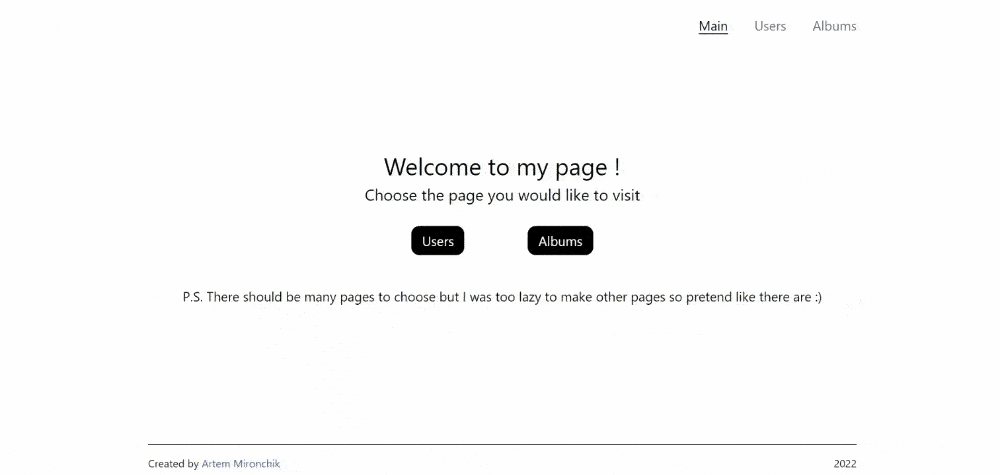

# React SPA & API

Multi-page project with the use of React-Router.

To check this project visit https://api-spa-react-kichnorim.vercel.app/.

## Preview

## Technologies

- React
- Tailwind.css
- React Router and React Router DOM 
- https://jsonplaceholder.typicode.com as API.

## Project Features

- Few Pages:
  - Main Page with links to other
  - Users Page
  - Albums Page
- Page for every user/album.
- Adaptive design

## Local install

### Pre-requirements:

- Node and NPM installed on your device

### Installation

- Clone this repository
- Run `npm install` in cloned folder
- Run `npm start` or `npm run start` to start project locally